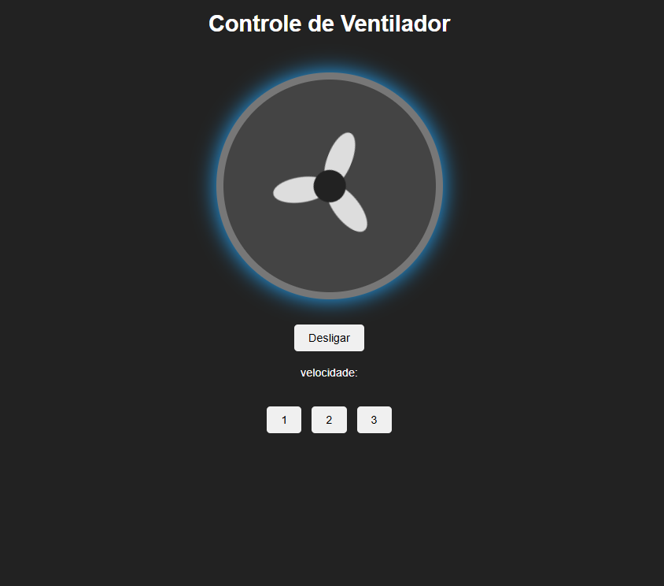

# Atividade - Controle de Ventilador com JavaScript

Projeto prático para simular o funcionamento de um ventilador interativo utilizando HTML, CSS e JavaScript puro (Vanilla JS).

## Índice

- Objetivo
- Estrutura do Projeto
- Requisitos da Atividade
- Desafios Extras Incluídos
- Regras da Atividade
- Como Executar

---

## Objetivo

Esta atividade tem como propósito praticar a integração entre tecnologias front-end essenciais, abordando os seguintes conceitos:
* Estruturação de elementos com HTML;
* Estilização avançada e animações de rotação (@keyframes) com CSS;
* Seleção de elementos no DOM através do JavaScript (document.getElementById);
* Manipulação de eventos de clique (addEventListener);
* Controle dinâmico de estados e estilos usando classList e estruturas condicionais (if e else).

---

## Estrutura do Projeto

O projeto deve ser organizado obrigatoriamente em arquivos separados na seguinte estrutura:

```text
ventilador/
│
├── index.html
├── style.css
└── script.js
```

---

## Requisitos da Atividade

### 1. HTML (index.html)
Deve conter uma página estruturada com:
* Um título principal: Controle do Ventilador;
* Uma área de exibição do status atual do aparelho;
* Uma representação visual do ventilador estruturada em divisões (tags div);
* Um botão principal para alternar entre Ligar e Desligar;
* Botões seletores para o controle de velocidade.

### 2. CSS (style.css)
O arquivo de estilos fornece a estrutura visual do ventilador (carcaça, miolo e 3 hélices anguladas em 120 graus). Ele gerencia dois estados principais:
* Desligado: Hélices estáticas e aparência padrão;
* Ligado: Adiciona uma sombra azul brilhante (box-shadow) e dispara a animação @keyframes girar de forma contínua (infinite).

### 3. JavaScript (script.js)
O comportamento dinâmico deve alternar o estado do ventilador. Ao clicar no botão principal:
* Se estiver desligado, o ventilador ativa a animação, o texto do botão muda para "Desligar" e o status atualiza para "Ligado";
* Se estiver ligado, o ventilador para, o texto do botão volta para "Ligar" e o status atualiza para "Desligado".

---

## Desafios Extras Incluídos

O escopo do projeto foi expandido para cobrir os seguintes desafios adicionais:

1. Controle de 3 Velocidades: Adicionados três botões numéricos (1, 2 e 3) que alteram o tempo de rotação das hélices através da manipulação da propriedade animationDuration no JavaScript:
   * Velocidade 1: Rotação lenta (animation-duration: 1.5s);
   * Velocidade 2: Rotação intermediária (animation-duration: 0.6s);
   * Velocidade 3: Rotação rápida (animation-duration: 0.15s).
2. Indicador de Status em Tempo Real: Um elemento de texto na interface exibe dinamicamente o estado atual do sistema (Exemplo: "Status: Ligado (Velocidade 2)" ou "Status: Desligado").

---

## Regras da Atividade

* O uso de bibliotecas ou frameworks externos (como jQuery, React, Bootstrap) é estritamente proibido;
* Toda a lógica de alternância e controle de tempo deve ser feita via JavaScript nativo;
* O código deve manter boas práticas de desenvolvimento, indentação consistente e nomes de classes e IDs semânticos.

---

## Como Executar

1. Baixe ou crie os arquivos deste repositório na sua máquina local;
2. Certifique-se de que os três arquivos (index.html, style.css, script.js) estão na mesma pasta (ventilador/);
3. Abra o arquivo index.html diretamente em qualquer navegador web moderno (Chrome, Edge, Firefox, Safari) ou utilize a extensão Live Server no VS Code.

